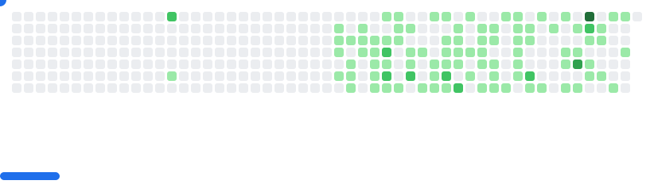

:wave: 你好！我是战神小猫

<picture>
  <source
    media="(prefers-color-scheme: dark)"
    srcset="images/breakout-dark.svg"
  />
  <source
    media="(prefers-color-scheme: light)"
    srcset="images/breakout-light.svg"
  />
  
</picture>

### Technology stack

